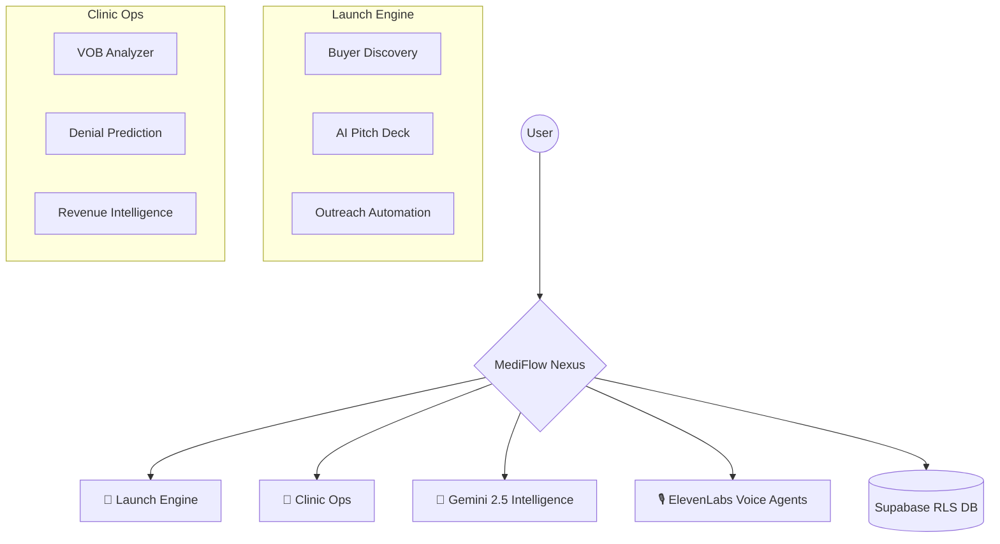

<p align="center">
  
  <br/>
  <strong>The Unified Intelligence Engine for the Healthcare Lifecycle</strong>
  <br/>
  <a href="https://mediflow-nexus-frontend-3692981377.us-central1.run.app"><strong>Live Production Dashboard ➔</strong></a>
</p>

<p align="center">
  
  
  
  
  
  
</p>

---

# 🏥 MediFlow Nexus: Intelligence Reimagined

**MediFlow Nexus** is a state-of-the-art AI intelligence platform designed to collapse the friction between healthcare innovation and clinical operations. Built on a foundation of **Google Gemini 2.5**, it serves as a dual-core operating system for the healthcare industry:

1.  **🚀 Launch Engine:** Accelerating Go-To-Market for medical startups.
2.  **🏥 Clinic Ops:** Optimizing Revenue Cycle Management (RCM) and insurance verification for hospitals.

---

## ⚡ The "Stitch White" Design System
MediFlow Nexus features a custom-engineered **monochromatic high-contrast UI**. 
- **Pure Aesthetics:** A museum-grade black-on-white interface that minimizes cognitive load.
- **Premium Feel:** Professional-grade typography and fluid micro-animations.
- **Accessibility:** Maximum legibility for clinical environments where split-second decisions matter.

---

## 🏗️ Core Architecture



---

## ✨ Primary Capabilities

### 🚀 Launch Engine (GTM for Startups)
*   **Buyer Discovery:** AI cross-references startup USPs with deep hospital profiles to find the "Perfect Match."
*   **8-Slide AI Pitch Deck:** Automatically generates investor-ready decks with custom ROI models for each prospect.
*   **AI Outreach:** Context-aware email drafting and **ElevenLabs voice memos** for personalized clinical pitch narration.
*   **Sales Pipeline:** Integrated Kanban system with AI-driven win probability scoring.

### 🏥 Clinic Ops (Hospital Intelligence)
*   **VOB AI Analyzer:** High-speed document processing to extract insurance coverage, exclusions, and waiting periods.
*   **Denial Prediction Engine:** Identifies high-risk claims before submission and provides actionable mitigation steps.
*   **Prior Auth Tracker:** Real-time visibility into authorization readiness and missing clinical documentation.
*   **Revenue Intelligence:** Advanced CPT profitability analysis and leakage detection dashboards.

---

## 🛠️ Technical Implementation

| Component | Technology | Role |
|-----------|------------|------|
| **Frontend** | Next.js (Standalone Mode) | Ultra-fast production builds with optimized NFT tracing. |
| **Intelligence** | Gemini 2.5 | Next-generation multi-modal processing for medical OCR and strategic analysis. |
| **Voice Synthesis** | ElevenLabs | High-fidelity voice cloning for pitch narration and outreach. |
| **Inference Fallback** | Groq (Llama-3) | High-speed redundancy for heavy analytical reasoning. |
| **Backend/Auth** | Supabase | Secure, type-safe database with strict Row-Level Security (RLS). |
| **Infrastructure** | Google Cloud Run | Scalable, serverless deployment via Docker & Artifact Registry. |

---

## 📂 Project Structure

```text
MediFlow-Nexus/
├── frontend/
│   ├── app/ (dashboard)/       # Core Intelligence Modules
│   ├── components/             # Monochromatic Component Library
│   ├── lib/supabase/           # Secure DB Infrastructure
│   ├── api/                    # AI & Inference Endpoints
│   └── Dockerfile              # Production Standalone Build
├── buyers.json                 # Proprietary Hospital Matching Dataset
├── supabase_schema.sql         # Secure RLS Schema
└── README.md                   # You are here
```

---

## 🚀 Getting Started

### Prerequisites
- Node.js 20+
- Google Cloud SDK (gcloud)
- Gemini & ElevenLabs API Keys

### Quick Start (Local)
```bash
cd frontend
npm install
npm run dev
```

### Production Deployment
MediFlow Nexus is optimized for **Google Cloud Run**.
```bash
# Deploys current state to high-performance GCP infrastructure
bash deploy-cloudrun.sh
```

---

## 🔐 Security & Compliance
- **HIPAA-First Design:** Data isolation through Supabase RLS.
- **Enterprise Ready:** Optimized for high-concurrency clinical workflows.
- **Transparent AI:** Every AI recommendation includes "Reasoning" logs for clinical auditing.

---

## 👥 The Team
**Hardik Hinduja** — Architect & Full-Stack Developer

---

<p align="center">
  <strong>MEDIFLOW NEXUS // PRODUCTION STABLE // ALL SYSTEMS OPERATIONAL</strong>
</p>
